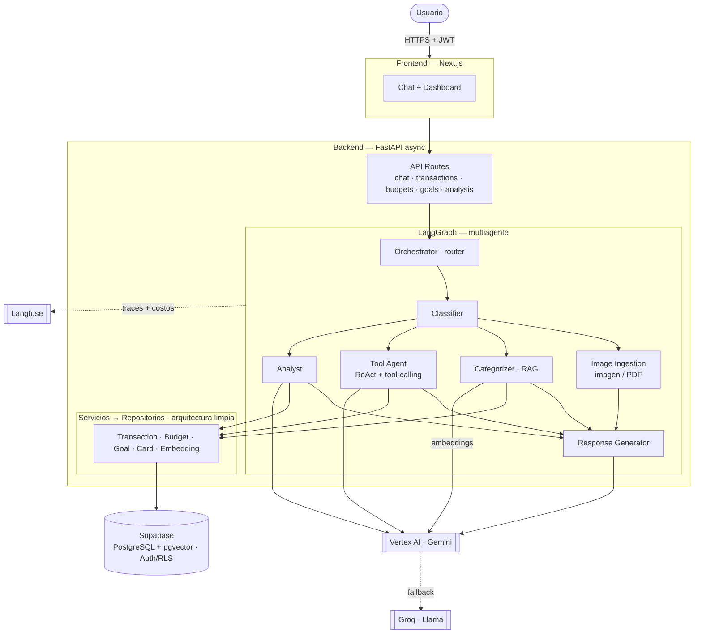

# Arquitectura — Safi

Safi es un asistente de finanzas personales basado en un **sistema multiagente con IA Generativa**. Permite registrar, consultar, corregir y analizar movimientos en lenguaje natural, con ingesta multimodal (imagen/PDF) y categorización automática.

## Stack tecnológico

| Capa | Tecnología |
|------|------------|
| Backend | Python 3.12 · FastAPI (async) |
| Orquestación de agentes | LangGraph · LangChain |
| LLM | Vertex AI (Gemini 2.5) · fallback Groq (Llama 3.3) |
| Embeddings | Vertex AI (gemini-embedding-001) |
| Base de datos + vectores | Supabase — PostgreSQL + pgvector |
| Autenticación | Supabase Auth (JWT · Row Level Security) |
| Observabilidad | Langfuse · Sentry · Grafana |
| Frontend | Next.js · React · TypeScript · Tailwind |
| Despliegue | Docker · Google Cloud Run · Secret Manager |

## Diagrama

## Sistema multiagente (LangGraph)

El grafo enruta cada mensaje según intención y complejidad:

- **Orchestrator (router)** — punto de entrada; decide el flujo.
- **Classifier** — clasifica intención y complejidad de la consulta.
- **Image Ingestion** — extrae movimientos de una imagen o PDF (multimodal), con confirmación previa de lo ambiguo.
- **Categorizer (RAG)** — categoriza el movimiento con embeddings + pgvector; soporta categorías propias del usuario.
- **Tool Agent (ReAct)** — agente con *tool-calling* que ejecuta acciones sobre datos reales mediante herramientas por dominio (transacciones, presupuestos, metas, tarjetas, recurrencias, análisis).
- **Analyst** — análisis financiero (resúmenes, tendencias).
- **Response Generator** — redacta la respuesta final en lenguaje natural.
- **Refusal** — maneja consultas fuera de alcance.

## Capas (arquitectura limpia)

Rutas (`app/api`) → Grafo (`app/agents`) → Servicios → Repositorios → base de datos. Las dependencias externas (LLM, embeddings, vector store, base de datos) se abstraen con **interfaces (ABCs)** en `app/shared/interfaces`, con implementaciones intercambiables en `app/shared/clients` (Vertex, Groq, pgvector, Supabase). Configuración, logging y observabilidad viven en `app/core`.

## Calidad

Tipado estricto (**mypy**), *linting* (**ruff**) y pruebas (**pytest**, con dobles/mocks — no requieren credenciales). El frontend se valida con lint, *typecheck* (tsc strict), tests y build de producción.
