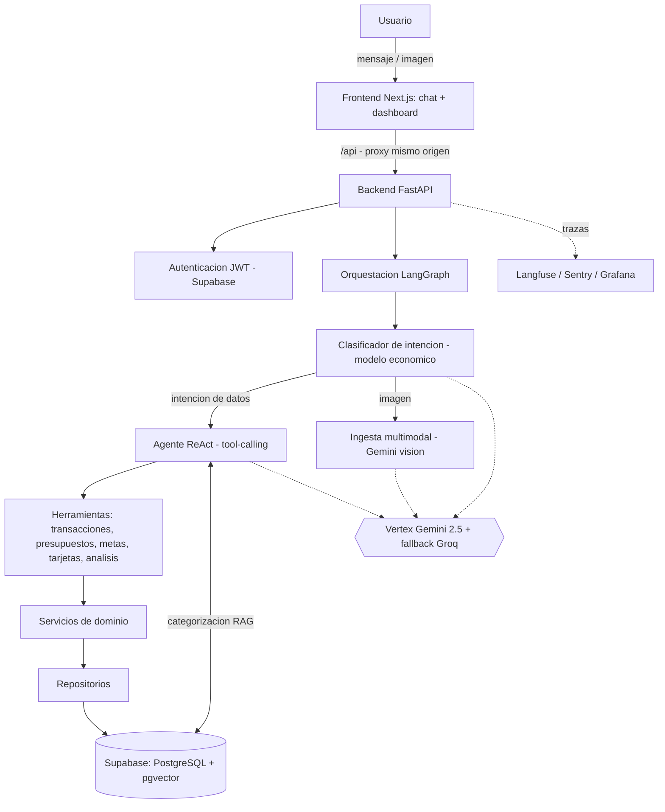

# 3. Requisitos y diseño de la solución

Definido el problema y su contexto, este capítulo concreta qué debe hacer Safi y cómo se ha
diseñado para lograrlo. Se parte de los requisitos —lo que el sistema debe cumplir—, se describe
la arquitectura y la decisión de diseño más relevante del proyecto, se justifica la selección
tecnológica (incluyendo dónde y por qué se apartó del anteproyecto) y se cierra con el diseño de
los datos y los flujos de información.

## 3.1. Requisitos funcionales y no funcionales

### Requisitos funcionales

- **RF1. Registro conversacional de movimientos.** Registrar ingresos y gastos descritos en
  lenguaje natural, indicando el método de pago cuando proceda (efectivo o crédito).
- **RF2. Consulta y corrección.** Consultar, corregir y eliminar movimientos identificándolos por
  su descripción —y, si hace falta, por importe o fecha—, sin que el usuario maneje identificadores.
- **RF3. Categorización flexible.** Clasificar automáticamente cada movimiento y admitir categorías
  propias definidas por el usuario, sin imponer un catálogo cerrado.
- **RF4. Presupuestos con alertas.** Crear, consultar, modificar y eliminar presupuestos por
  categoría, con aviso al acercarse al límite.
- **RF5. Metas de ahorro.** Crear metas, aportar a ellas, consultar su progreso y eliminarlas.
- **RF6. Tarjetas de crédito.** Registrar tarjetas y sus pagos, consultar el estado del ciclo
  (deuda, disponible, próxima fecha de pago) y actualizarlas o darlas de baja.
- **RF7. Análisis financiero.** Ofrecer resúmenes, desglose de gasto por categoría y un diagnóstico
  orientativo de la situación del usuario.
- **RF8. Ingesta multimodal.** Extraer los movimientos a partir de una imagen (foto o captura de
  una hoja de cálculo) y confirmarlos con el usuario antes de registrarlos.
- **RF9. Memoria.** Mantener el contexto de la conversación (multi-turno) y un conocimiento
  persistente del usuario entre sesiones.
- **RF10. Cuentas de usuario.** Permitir registro e inicio de sesión, con un proceso de bienvenida
  (onboarding) opcional.
- **RF11. Panel de resumen.** Mostrar un dashboard con lo presupuestado frente a lo gastado, el
  reparto entre crédito y efectivo y el estado de las tarjetas.

### Requisitos no funcionales

- **RNF1. Seguridad.** Autenticación mediante JWT, aislamiento estricto de los datos por usuario y
  externalización de credenciales.
- **RNF2. Fiabilidad.** Degradación elegante ante fallos: cadena de respaldo entre modelos, salidas
  estructuradas y validaciones que eviten operaciones erróneas.
- **RNF3. Observabilidad.** Trazabilidad de cada conversación y cada llamada al modelo (tokens,
  coste, latencia), seguimiento de errores y métricas de operación.
- **RNF4. Eficiencia y coste.** Enrutar la mayor parte del tráfico a un modelo económico, ejecutar
  en paralelo las herramientas independientes y acotar el consumo con límites y tiempos de espera.
- **RNF5. Mantenibilidad.** Código organizado según arquitectura limpia y DDD, con tipado estricto y
  pruebas automatizadas.
- **RNF6. Usabilidad y accesibilidad.** Interfaz web *responsive*, accesible y en español.
- **RNF7. Reproducibilidad.** Empaquetado en contenedores y despliegue documentado paso a paso.
- **RNF8. Portabilidad.** Proveedores externos (modelo, embeddings, almacén vectorial) sustituibles
  detrás de interfaces, sin afectar a la lógica de negocio.

## 3.2. Arquitectura de la solución

Safi se estructura en dos servicios: un **frontend** web (Next.js) y un **backend** (FastAPI). El
frontend redirige sus peticiones `/api` al backend en el mismo origen, lo que evita la
configuración de CORS y mantiene el token de sesión en la cabecera de autorización. El backend
sigue una **arquitectura limpia por capas**: las rutas hablan en DTOs, los servicios encapsulan la
lógica de dominio, los repositorios se encargan del acceso a datos y, por debajo, se apoya en
Supabase (PostgreSQL). La capa de agentes, orquestada con LangGraph, es la que dota de inteligencia
al sistema.

El recorrido de una petición es el siguiente. El mensaje del usuario entra por el backend, que lo
autentica y lo entrega al grafo. Un **clasificador de intención**, servido por un modelo económico,
decide de qué trata la petición y encamina el flujo. La mayoría de las intenciones —registrar,
consultar, analizar— van a un único **agente de razonamiento y acción (ReAct)** que, apoyándose en
un modelo más capaz, decide qué herramientas invocar, las ejecuta —varias en paralelo si son
independientes— y observa sus resultados hasta componer la respuesta. Cada herramienta es una
envoltura fina sobre un servicio de dominio, de modo que el modelo nunca accede directamente a la
base de datos. Cuando la petición trae una imagen, el flujo se desvía a un **proceso de ingesta
multimodal** dedicado. En paralelo a todo ello, cada conversación y cada llamada al modelo quedan
trazadas para su observación.

*(Diagrama en Mermaid; puede renderizarse en cualquier editor compatible —por ejemplo,
mermaid.live— para incrustarlo como imagen en la memoria.)*

### Decisión de diseño: agente ReAct frente a arquitectura multiagente

## 3.3. Selección tecnológica

La tabla siguiente resume el stack, contrastándolo con el que se preveía en el anteproyecto y
apuntando el motivo del cambio cuando lo hubo.

Dos ideas justifican el conjunto. La primera es la **consolidación en Google Cloud y Supabase**:
frente a la dispersión inicial (Cohere, Pinecone, PostgreSQL por separado), reunir modelo,
embeddings, base de datos, vectores y autenticación en dos proveedores reduce la complejidad de
integración y despliegue, aprovecha los créditos de GCP disponibles y abarata la operación. La
segunda es el **control del coste**: los servicios elegidos escalan a cero cuando no se usan y se
apoya en un enrutamiento por complejidad —un modelo económico para clasificar y el modelo capaz solo
cuando hace falta—, de modo que el gasto en tokens se mantiene bajo. Que estos cambios respecto al
anteproyecto fueran posibles sin reescribir la lógica de negocio se debe a que cada proveedor externo
se accede detrás de una interfaz, lo que los hace intercambiables (RNF8).

## 3.4. Diseño de datos y flujos de información

### Modelo de datos

La información se organiza en un modelo relacional en PostgreSQL. Las entidades principales son las
**transacciones** (importe, tipo, descripción, categoría, fecha, método de pago y, si aplica, la
tarjeta asociada), los **presupuestos** (límite por categoría y umbral de alerta), las **metas** de
ahorro (objetivo y progreso), las **tarjetas de crédito** y sus **pagos** (límite, día de corte y de
pago, ciclo), y el **perfil** del usuario. A ello se suman las **conversaciones** y sus **mensajes**
(memoria a corto plazo), el **conocimiento del usuario** (memoria a largo plazo, como pares
clave-valor) y una tabla de **vectores** para la búsqueda semántica. Toda entidad se asocia a un
identificador de usuario, que es la base del aislamiento entre usuarios.

Dos decisiones de modelado merecen mención. Los importes se tratan con precisión decimal exacta
—nunca con coma flotante— para evitar errores de redondeo en dinero, y se persisten como valor
numérico exacto. La categoría se almacena como **texto**: existe un vocabulario canónico de
referencia, pero el usuario puede introducir categorías propias que se conservan tal cual, lo que da
soporte a la categorización flexible (RF3).

### Flujo de categorización (RAG)

Cuando un movimiento no llega con categoría explícita, su descripción se convierte en un vector con
el modelo de embeddings y se compara, por similitud del coseno, con un conjunto de ejemplos de
categorías previamente indexados en pgvector. Si la coincidencia supera un umbral, se asigna esa
categoría; si no, se etiqueta como "otros". Las categorías propias del usuario no pasan por este
proceso: se respetan directamente.

### Flujo de ingesta multimodal

Cuando el usuario adjunta una imagen, esta viaja al modelo de visión junto con una instrucción de
extracción que pide devolver los movimientos en un formato estructurado (descripción, importe,
fecha, categoría y método de pago). El resultado no se registra a ciegas: se presenta al usuario como
una propuesta que enumera lo leído y señala lo ambiguo, y solo tras su confirmación se registran los
movimientos en lote, reutilizando las mismas herramientas del agente. Este diseño —extraer, proponer,
confirmar y registrar— antepone el control del usuario sobre sus propios datos.

### Flujos de memoria

La memoria a corto plazo se resuelve recuperando de la base de datos los últimos mensajes de la
conversación y aportándolos como contexto al agente. La memoria a largo plazo funciona de forma
distinta: tras cada turno, y sin bloquear la respuesta, un proceso extrae del diálogo hechos
duraderos sobre el usuario y los guarda para enriquecer las conversaciones futuras. El detalle de
implementación de todos estos flujos se aborda en el capítulo 4.

| Componente         | Anteproyecto          | Elección final                                           | Motivo del cambio                                                                       |
| ------------------ | --------------------- | --------------------------------------------------------- | --------------------------------------------------------------------------------------- |
| Lenguaje backend   | Python                | Python 3.12                                               | — (requisito del máster)                                                              |
| Framework backend  | FastAPI               | FastAPI                                                   | — (asíncrono, tipado, OpenAPI)                                                        |
| Orquestación      | LangGraph / LangChain | LangGraph / LangChain                                     | —                                                                                      |
| Modelo de lenguaje | Cohere                | Vertex AI**Gemini 2.5** + respaldo Groq (Llama 3.3) | Créditos de GCP, capacidad multimodal, buen rendimiento en español y niveles de coste |
| Embeddings         | Cohere v3             | Vertex**gemini-embedding-001** (768)                | Consolidación en Google                                                                |
| Almacén vectorial | Pinecone              | **pgvector** (en Supabase)                          | Dominio estructurado (SQL-first); RAG de apoyo; una sola base de datos                  |
| Base de datos      | PostgreSQL            | **Supabase** (PostgreSQL gestionado)                | Integra base de datos, autenticación y pgvector                                        |
| Autenticación     | JWT + OAuth2          | Supabase Auth (**JWT**)                             | Menos código propio, seguridad gestionada                                              |
| Frontend           | React + TS + Tailwind | **Next.js** + React + TS + Tailwind                 | App Router y despliegue sencillo                                                        |
| Observabilidad     | —                    | **Langfuse + Sentry + Grafana**                     | Añadido: control de coste y errores                                                    |
| Despliegue         | Docker                | Docker +**GCP Cloud Run** + Secret Manager          | Añadido: despliegue reproducible en la nube                                            |

El anteproyecto planteaba cinco agentes especializados (orquestador, categorizador, analista,
planificador y recomendador) coordinados con un esquema de planificación explícita. Durante el
desarrollo esa arquitectura se revisó y se sustituyó por un **clasificador ligero como enrutador
más un único agente ReAct** con herramientas. La razón es de fondo, no de comodidad. Las peticiones
de finanzas personales son casi siempre cortas y de una sola operación —"registra este gasto",
"¿cuánto llevo este mes?"—; para ese perfil, elaborar un plan escrito y pasarlo por un ejecutor y un
replanificador es un sobrecoste que no aporta valor. Un agente ReAct colapsa planificar, ejecutar y
replanificar en un mismo bucle de razonamiento-acción, resulta más barato y rápido, y admite de
forma natural la ejecución de varias herramientas en paralelo. La trazabilidad que era la principal
ventaja del enfoque multiagente se obtiene igualmente a través de la observabilidad. El clasificador
se conserva porque no es redundante: hace un triaje barato que mantiene la mayor parte del tráfico
lejos del agente más costoso. Esta decisión ilustra un principio que guio el proyecto: ajustar la
complejidad de la solución a la del problema, y no al revés.
